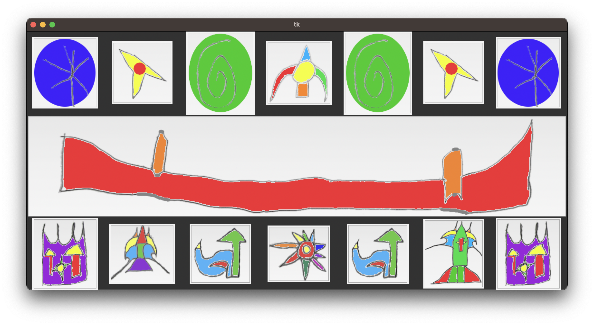
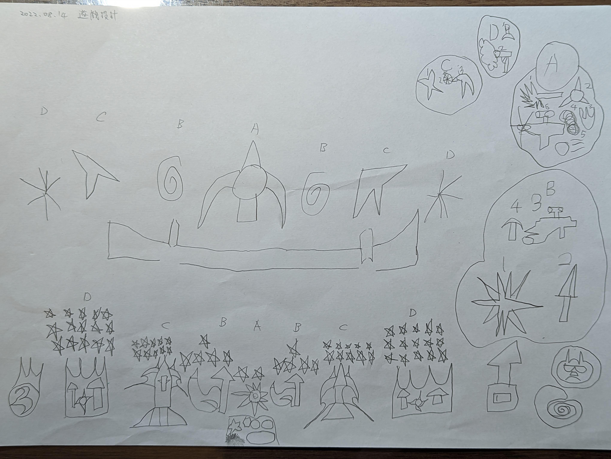

KingDiamond (奪戰國王的寶石)
===========

A game initiated and designed by my son.

## How to run
Run the Python3 program with 'python-vlc' module (for playing background music) and 'tkinter' module (for GUI).

To run the command line version,
```
$ python3 game_cli.py
['D', 'C', 'B', 'A', 'B', 'C', 'D']
===================================
['D', 'C', 'B', 'A', 'B', 'C', 'D']
Enter your choice: 
B
Computer: D, You: B
You win
['D', 'C', 'B', 'A', 'B', 'C', 'X']
===================================
['D', 'C', 'B', 'A', 'B', 'C', 'D']
Enter your choice: 
...
```

To run the GUI version,
```
$ python3 game_gui.py
```


## How to play
Please refer to the original design in the design.jpg.


There are 2 teams seperated by a wall in the middle. The top side is our enemy played by the computer. The bottom side is us.

For each team, there are 4 roles represented by A, B, C and D. A can kill B or C. B can kill C or D. C can kill D. And D can kill A. For each round, we need to select a role to go fighting. If both teams select the same role, we need to select a weapon represented by a number (only for command line version). The rule is similar: weapon 1 can kill weapon 2 to n - 1, weapon 2 can kill weapon 3 to n, ..., weapon n can kill weapon 1. Basically in this case, I would strongly suggest you to just pick weapon 1 to have higher probability to win.

If all the enemy roles are killed, we win. Otherwise, if all our roles are killed, we lose.
